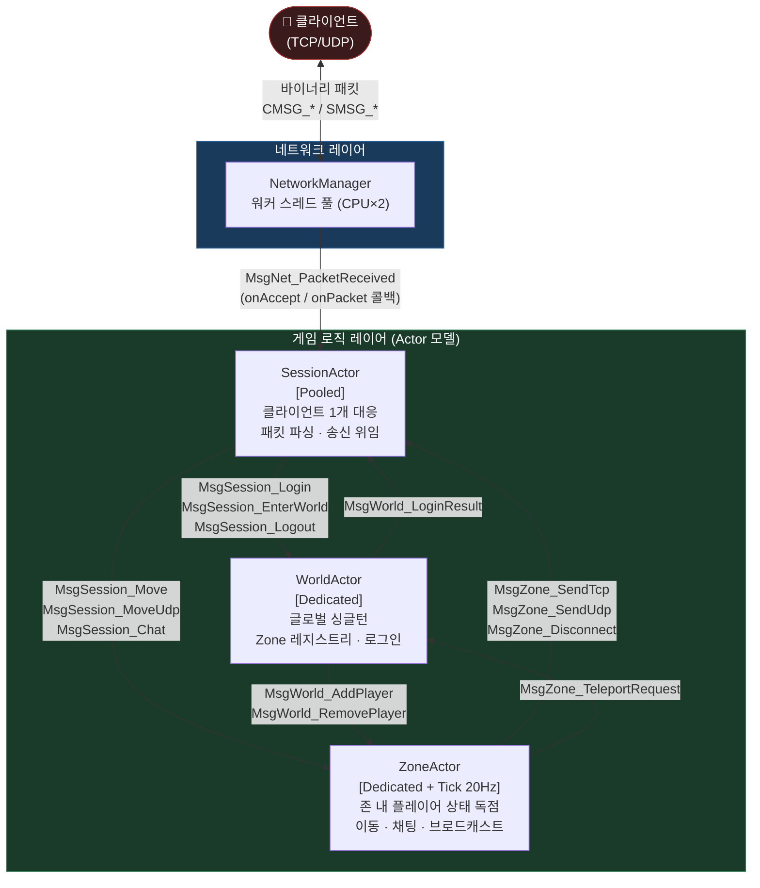
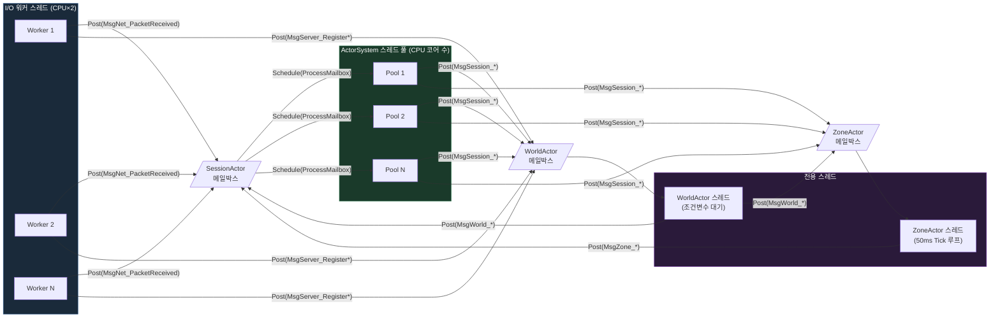
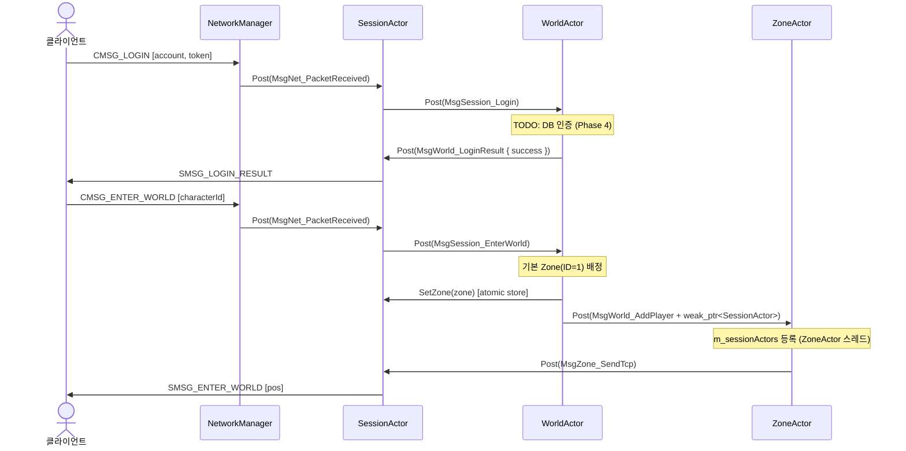
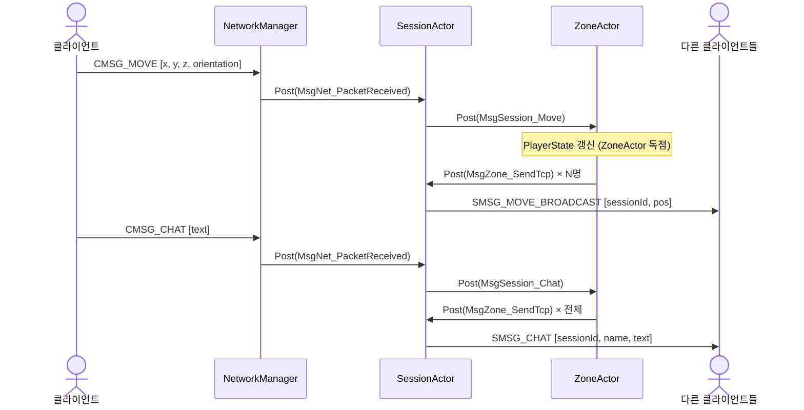
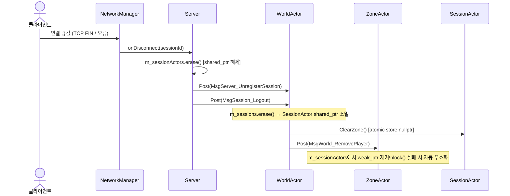

# Nexus-Engine 아키텍처

## 레이어 구조

서버는 두 계층으로 분리됩니다. 네트워크 레이어는 I/O만 담당하고, 게임 로직 레이어는 Actor 모델로 상태를 관리합니다.

```
┌─────────────────────────────────────────────────────────┐
│                      클라이언트                           │
└───────────────────────┬─────────────────────────────────┘
                        │ TCP / UDP 패킷 (바이너리 직렬화)
┌───────────────────────▼─────────────────────────────────┐
│               네트워크 레이어 (ServerNet)                  │
│   epoll / IOCP · 워커 스레드 풀 · 패킷 수신/송신            │
│   패킷 역직렬화 → 내부 메시지 변환 (경계층)                  │
└───────────────────────┬─────────────────────────────────┘
                        │ 내부 메시지 (C++ 값 타입, 직렬화 없음)
┌───────────────────────▼─────────────────────────────────┐
│               게임 로직 레이어 (Actor 모델)                 │
│   SessionActor · WorldActor · ZoneActor                  │
│   메일박스 기반 메시지 패싱 · 락-프리 MPSC 큐               │
└─────────────────────────────────────────────────────────┘
```

---

## Actor 관계도



---

## 스레드 모델



> **핵심 원칙**: 각 Actor는 자신의 스레드에서만 상태를 읽고 씁니다.
> 외부에서 직접 접근하지 않고 반드시 `Post()`를 통해 메시지를 보냅니다.

---

## 주요 메시지 흐름

### 로그인 시퀀스



### 이동 / 채팅 시퀀스



### 연결 해제 시퀀스



---

## Actor 별 책임 요약

| Actor | 실행 모드 | 스레드 | 소유 상태 | 주요 역할 |
|---|---|---|---|---|
| `SessionActor` | Pooled | ActorSystem 풀 | 없음 (상태 없는 라우터) | 패킷 파싱, 메시지 라우팅, 클라이언트 송신 |
| `WorldActor` | Dedicated | 전용 1개 | Zone 레지스트리, Session 레지스트리 | 로그인, 존 배정, 텔레포트 중개 |
| `ZoneActor` | Dedicated + Tick | 전용 1개 | `m_players` (PlayerState 맵) | 게임 로직, 이동 검증, AOI 브로드캐스트 |

---

## 패킷 vs 내부 메시지 경계

`SessionActor::Handle(MsgNet_PacketReceived)`가 두 레이어의 경계입니다.

```
클라이언트 패킷 (바이너리)          내부 메시지 (C++ 값 타입)
─────────────────────────     ─────────────────────────────────
직렬화 필요                    직렬화 없음
opcode + payload bytes         타입 안전 struct
최소 크기, MTU 제한             shared_ptr, string 자유롭게 사용
보안 검증 필요                  신뢰된 내부 레이어
클라이언트 호환성 고려           서버 내부 변경 자유
```

```
CMSG_LOGIN [string account][string token]   (바이너리 와이어)
        │
        │  역직렬화 (SessionActor)
        ▼
MsgSession_Login { sessionId, accountName, token }  (C++ 타입)
```

---

## 스레드 안전성 설계

| 항목 | 해결 방법 |
|---|---|
| `WorldActor::m_sessions` 외부 접근 | `MsgServer_RegisterSession` Post로 전환 — WorldActor 스레드 독점 |
| `ZoneActor::m_sessionActors` 외부 등록 | `MsgWorld_AddPlayer`에 `weak_ptr<SessionActor>` 실어서 ZoneActor 스레드 내부 등록 |
| `SessionActor::m_zone` 크로스 스레드 쓰기 | `std::atomic<ZoneActor*>` + acquire/release |
| `SessionActor` 댕글링 포인터 | `m_sessionActors`를 `weak_ptr`로 교체, `lock()` 실패 시 무시 |
| `MpscMailbox` 다중 생산자 | Michael-Scott 알고리즘 lock-free 큐 |
| false sharing | `m_head`/`m_tail` `alignas(64)` 적용 |
